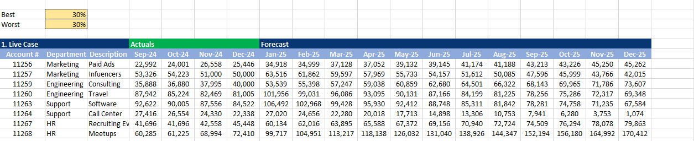
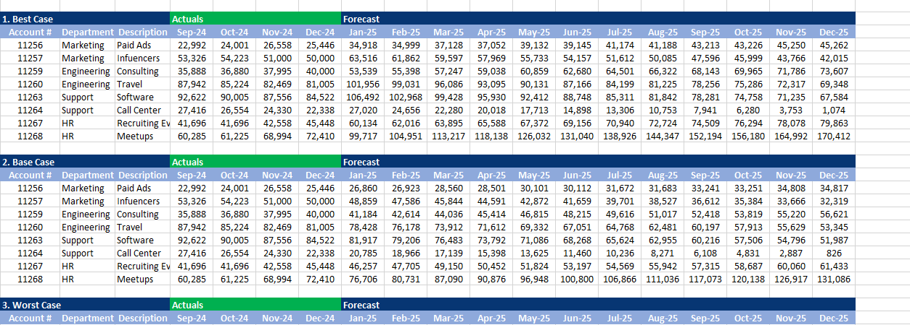
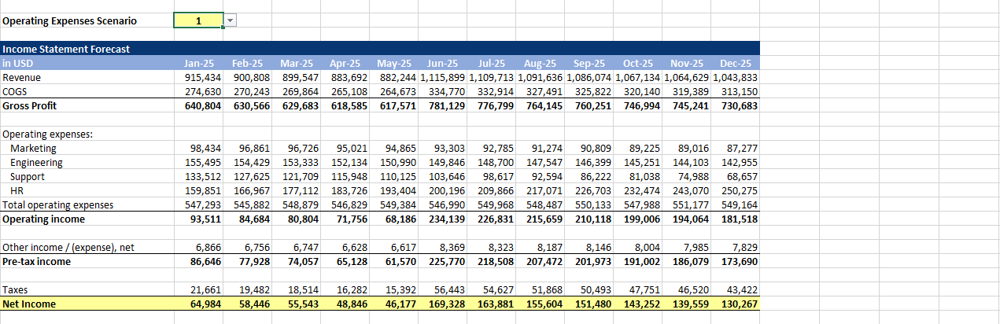
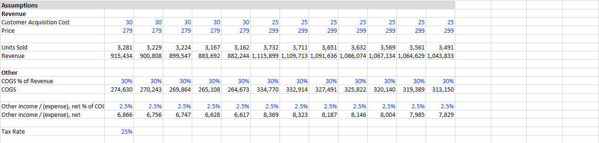

# Budget & Forecast Model (with Scenarios)

A departmental budget and forecast model with scenario analysis (Best Case, Base Case, and Worst/Live Case).

## Model Overview

This model forecasts operating expenses by department and flows into a full Income Statement forecast.

### Key Features
- Monthly forecast (Jan–Dec 2025)
- Three scenarios: Best Case, Base Case, and Live/Worst Case
- Department-level operating expense planning (Marketing, Engineering, Support, HR)
- Linked Income Statement forecast
- Driver-based assumptions (Price, Units Sold, COGS %, Tax Rate, etc.)

## Scenario Operating Expenses

The model allows switching between different operating expense scenarios.

## Income Statement Forecast

Fully linked Income Statement driven by the selected scenario and key assumptions.

## Key Assumptions

- Customer Acquisition Cost
- Price
- Units Sold
- COGS as % of Revenue
- Other Income/(Expense)
- Tax Rate

## Notes
This model was built to practice core FP&A skills including budgeting, forecasting, and scenario planning.
